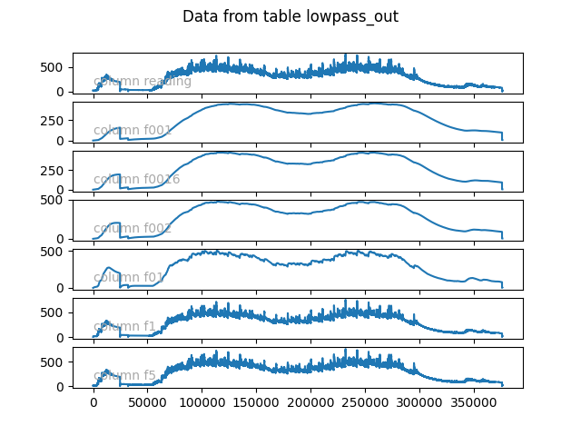
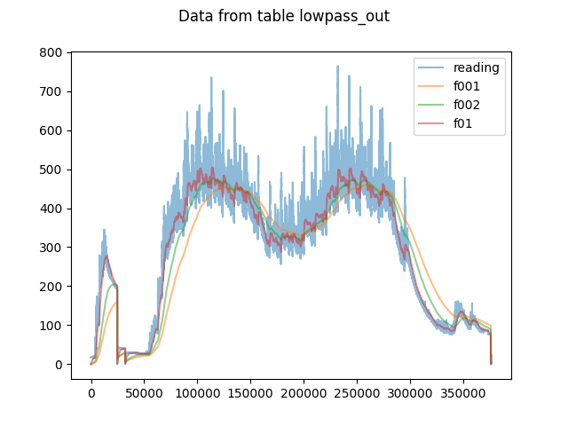
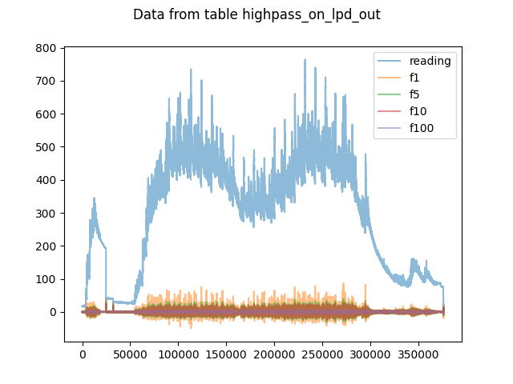
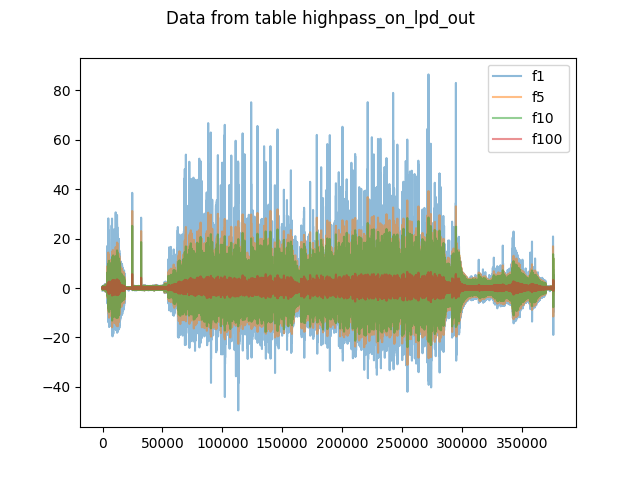
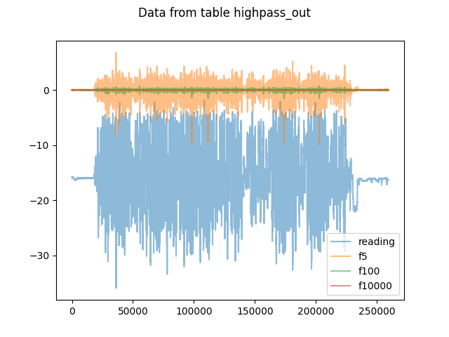
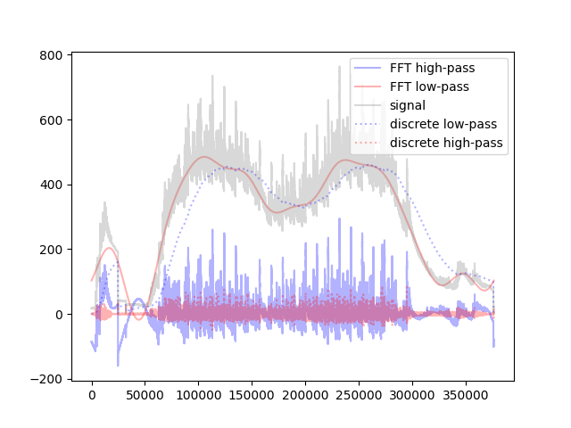

# Table of Contents

1.  [Python Bandpass filters](#org4b48181)
2.  [Installation](#org6806c21)
    1.  [Execute the following scripts from the source directory](#orga217a61)
        1.  [Loading the data into Vertica from the CSV file](#org17e3e15)
    2.  [Loading the libraries](#org51c3bd0)
        1.  [Loading the lowpass library](#org20014ee)
        2.  [Loading the highpass library](#org23719b7)
    3.  [Running the functions](#org39510f2)
        1.  [plowpass](#org9632d7d)
        2.  [highpass](#org5135c50)
    4.  [Plotting the result](#org58092cc)
3.  [High pass filter](#orgfb758bf)
    1.  [Running the highpass filter on the low-pass data](#orgb4c7aff)
    2.  [Running the highpass filter on the highpass data](#org12f0c5c)
4.  [Comparison of these filters to filtering with Fourier Transforms](#orgfd8a3a1)

# Python Bandpass filters

This repository contains Python user-defined functions (UDFs) for
highpass and low-pass filters on time-series data.

The algorithms implemented are drawn from the descriptions of the
discrete-time versions described in Wikipedia: 

-   <https://en.wikipedia.org/wiki/Low-pass_filter>
-   <https://en.wikipedia.org/wiki/High-pass_filter>

# Installation

## Execute the following scripts from the source directory

The following scripts use **pwd** to set the absolute pathname of
**lowpassdata.csv**, **highpassdata.csv**,the **lowpass.py** library, and
the **highpass.py** library.  Please execute them in the directory where
those files are located.

### Loading the data into Vertica from the CSV file

(Note: the following SQL scripts presume that your Vertica has
flextables installed.)

For historical reasons we have two data-sets intended for the
different filters &#x2014; **highpass.csv** and **lowpass.csv**.  The
algorithms can be run on either dataset, of course.

    vsql -f lowpass_load.sql
    vsql -f highpass_load.sql

**lowpassload.sql** will load the data from **lowpassdata.csv** into a flextable,
**lowpassdata**.  It then derives a standard Vertica table,
**lowpassdatawithdeltas**, which has columns:

-   **rown:** The row number of the data
-   **tstamp:** The timestamp from the data (**rown** and **tstamp** may be
    redundant, as they have the same ordering).
-   **dt:** the "delta" of this row's timestamp from the previous row's
    timestamp.  Used as the "delta-t" in the discrete low- and
    highpass filter algorithms.
-   **reading:** the sensor reading for this time
-   **dreading:** the "delta" of this reading from the previous row's
    reading.  Used as the "delta-signal" in the discrete
    low- and highpass filter algorithms.

**highpassload.sql** does the same thing for the highpass data in
**highpass.csv**, creating:
**lowpassdata**.  It then derives a standard Vertica table,
**highpassdatawithdeltas**, which has similar columns to
**\*lowpassdatawithdeltas**: 

-   **rown:** The row number of the data
-   **tstamp:** The timestamp from the data (**rown** and **tstamp** may be
    redundant, as they have the same ordering).
-   **dt:** the "delta" of this row's timestamp from the previous row's
    timestamp.  Used as the "delta-t" in the discrete low- and
    highpass filter algorithms.
-   **reading:** the sensor reading for this time
-   **dreading:** the "delta" of this reading from the previous row's
    reading.  Used as the "delta-signal" in the discrete
    low- and highpass filter algorithms.

## Loading the libraries

The libraries are loaded by the first few lines of **lowpassload.sql**
and **highpassload.sql**.  These two SQL scripts must be run in the
directory containing **plowpass.py** and **highpass.py**.

### Loading the lowpass library

We inform Vertica about the file to load the library from by giving it
an absolute pathname to the library, then informing Vertica how to
find the function-factory within the library.

Run these commands in the directory containing **plowpass.py**:

    \set library lowpasslib
    \set libfile ''''`pwd`'/p_lowpass.py'''
    
    DROP LIBRARY IF EXISTS :library CASCADE;
    CREATE LIBRARY :library AS :libfile LANGUAGE 'Python';
    CREATE FUNCTION lowpass 
        AS LANGUAGE 'Python' NAME 'p_lowpass_factory' 
        LIBRARY :library fenced;

### Loading the highpass library

The commands for loading the highpass library are similar to those
used to load the lowpass library.  

Run these commands in the directory containing **lowpass.py**:

    \set library highpasslib
    \set libfile ''''`pwd`'/highpass.py'''
    
    drop library :library cascade;
    CREATE LIBRARY :library AS :libfile LANGUAGE 'Python';
    CREATE FUNCTION highpass AS LANGUAGE 'Python' NAME 'highpass_factory' LIBRARY :library fenced;

## Running the functions

There are two files, **highpassrun.sql** and **lowpassrun.sql** which
can be used to run the libraries.

### plowpass

**lowpassrun.sql** runs the lowpass algorithm across several sets of
parameters for frequency and for "alpha".  The alpha parameter is
meaningful in the context of the viewing the lowpass filter as an RC
circuit (alpha = RC/(RC + deltat)).

The interface for the lowpass function is:

    p_lowpass(
        <float-delta-time>, 
        <float-sensor-reading> 
        USING PARAMETERS "frequency" = <float-frequency-in-hz>
    ) ORDER BY timestamp;
    --- or
    p_lowpass(
        <float-delta-time>, 
        <float-sensor-reading> 
        USING PARAMETERS "alpha" = <float-alpha>
    ) ORDER BY timestamp;

It returns a float value for each row representing the output of the
lowpass filter at that point.

Where:

-   **<float-delta-time>:** the time-interval between this sensor
    reading and the previous one in seconds (e.g., 0.01)
-   **<float-sensor-reading>:** the sensor reading in whatever units
    you're measuring
-   **<float-frequency-in-hz>:** the cutoff frequency for the filter in
    hertz
-   **<float-alpha>:** 0 < alpha < 1

**alpha** can be defined in terms of frequency, **f** and **deltaT**:

alpha = deltaT / (RC + deltaT)

alpha = 2\*pi\*deltaT\*f/((2\*pi\*deltaT\*f) + 1)

Similarly, **f** can ge defined in terms of **alpha** and **deltaT**:

f = alpha/((1-alpha)\*2\*pi\*deltaT)

### highpass

**highpassrun.sql** runs the highpass algorithm on the
**highpassdatawithdeltas** table created by **highpassload.sql**,
\*using different cutoff frequencies.

The interface for the highpass function is:

    highpass(<float-frequency>, <float-delta-time>, <float-sensor-reading>) 
    ORDER BY timestamp;

Where:

-   **<float-frequency>:** the cutoff frequency in hertz
-   **<float-delta-time>:** the time-interval between this sensor reading
    and the previous one, in seconds, e.g., 0.01.
-   **<float-sensor-reading>:** the sensor reading in whatever units
    you're measuring.

## Plotting the result

**plotparallel.py** uses the **verticapython** python module to read the data from
Vertica.  

It takes as arguments a list of column names and a table name, e.g., 

    python3 plot_parallel.py reading f001 f0016 f002 f01 f1 f5 lowpass_out

The "fnnn" column names are derived from 0.001, 0.0016, 0.002, 0.01,
.1 and .5 hertz.  On these plots, a 1 hertz signal would be 100 ticks
wide on the **x**-axis. 

Will create (separate) plots of the **reading**, **f001**, **f0016**,
**f002**, **f01**, **f1**, and  **f5** columns of the **lowpassout** table
created by **lowpassrun.sql**.

It puts its output into a PNG file with a name constructed from the
table and column names, as well as running an interactive display
which can be manipulated.  Note that the vertical scales may differ.

Here is an example of the output:

(X-axis measures "ticks" in the data-set &#x2014; ticks are uniformly
happening at 0.01 second in the lowpass dataset.)

Stacking the plots as **plotparallel.py** does is useful when comparing
things with radically different ranges in the vertical axis.  For
things like the lowpass output, which cover the same range in the
vertical axis, you can also use **plotoverlay.py** to look at three
columns on one plot:

    python3 plot_overlay.py reading f001 f002 f01 lowpass_out

The results are seen here:

This plot shows a problem with this implementation of a low-pass
filter: namely, as the critical frequency decreases the system has
more "inertia" responding to changes in the signal more slowly.  The
curve gets smoother, but part of that smoothness comes at a cost in
delay.

# High pass filter

## Running the highpass filter on the low-pass data

The first argument in the **highpass** UDF is frequency in hertz.  In
this data-set, a one-hertz signal takes 100 units on the **x** axis.

    DROP TABLE IF EXISTS highpass_on_lpd_out CASCADE;
    CREATE TABLE highpass_on_lpd_out AS
    SELECT lowpass_data_with_deltas.row_n,
           reading,
           highpass(1, dt, reading) as f1,
           highpass(5, dt, reading) as f5,
           highpass(10, dt, reading) as f10,
           highpass(100, dt, reading) as f100
    FROM lowpass_data_with_deltas ORDER BY row_n; 

With the results shown here:

Surprise!  The highpass signal is down around 0!  It doesn't follow
the offset of the signal.  Why?  The offset is **low-frequency data**
that gets filtered out.

If we set aside the raw input, we can see more detail in the highpass
output: 

## Running the highpass filter on the highpass data

The script **highpassrun.sql** runs the highpass filter on the highpass
dataset loaded by **highpassload.sql**.

Plotted with 

    python3 plot_overlay.py reading f5 f100 f10000 highpass_out

(which ignores some of the columns) produces the following results:

# Comparison of these filters to filtering with Fourier Transforms

Partly because of annoyance at the squiggles that remain in the
lowpass filter output, I decided to compare these functions to
filtering with Fourier transforms.  Basically, take Fourier Transform
of the signal, lop off the frequencies you're not interested in, then
take the inverse-Fourier Transform to see the filtered signal.

The file **fft.py** uses the **numpy.fft** module to take the Fast Fourier
Transform (FFT) of the entire dataset, then plots the result in
comparison to some of the results of the lowpass and highpass discrete
filters.

The following plot shows a comparison between filtering-via FFT and
filtering via discrete filters:

The FFT software used reads the entire contents of the array into
memory, so it is limited in the size of the table it processes.

